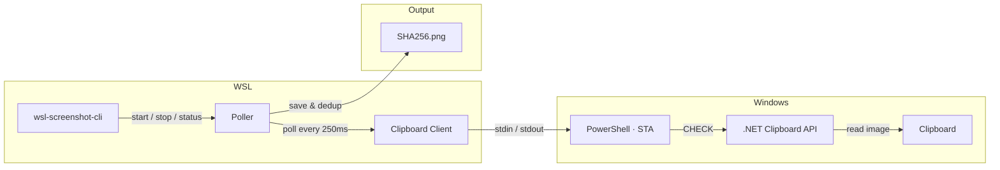

# wsl-screenshot-cli

Maintained fork of [`Nailuu/wsl-screenshot-cli`](https://github.com/Nailuu/wsl-screenshot-cli).

Original project concept and implementation are by Nailuu. This fork keeps the same core idea, then adds the fixes developed in this workspace for real WSL usage with Claude Code, Codex CLI, and Windows clipboard history.

This README is adapted from the upstream project README, then updated to describe the fork-specific behavior and installation URLs in this repository.

Take a screenshot on Windows, then paste in your WSL terminal and WSL-aware apps without giving up normal Windows clipboard behavior.


### Quick Start

```bash
wsl-screenshot-cli start --daemon   # start monitoring
wsl-screenshot-cli status           # check it's running
wsl-screenshot-cli stop             # stop monitoring
wsl-screenshot-cli update           # update to latest version
```

## Installation

### Quick install (recommended)

```bash
curl -fsSL https://raw.githubusercontent.com/cyanyux/wsl-screenshot-cli/main/scripts/install.sh | bash
```

This downloads the latest binary to `~/.local/bin/`. No Go toolchain required.

### Why this fork exists

Compared with upstream, this fork adds:

- Linux clipboard image mirror for `Ctrl+V` flows that read native `image/png`
- managed-path refresh so Windows clipboard history (`Win+V`) can restore prior screenshots cleanly
- safer clipboard handling for Office / PowerPoint text copies that include preview bitmaps
- daemon lifecycle fixes to prevent duplicate background instances after stop/start races

### Credit

- Upstream project: <https://github.com/Nailuu/wsl-screenshot-cli>
- Original author: Nailuu
- This fork: packaging, Linux clipboard sync, clipboard-history refresh, and daemon/runtime fixes
- Demo asset and baseline README structure originate from the upstream project

### Via Go

```bash
go install github.com/cyanyux/wsl-screenshot-cli@latest
```

### From source

```bash
git clone https://github.com/cyanyux/wsl-screenshot-cli.git
cd wsl-screenshot-cli
go build -o wsl-screenshot-cli .
```

### Auto-start options

**Option 1** — Auto-start with your shell (add to `~/.bashrc` or `~/.zshrc`):

```bash
wsl-screenshot-cli start --daemon --quiet
```

> **Tip:** The `--quiet` flag prevents the `Polling process is already running` message from appearing each time you open a new terminal.

> **Note:** The install script places the binary in `~/.local/bin/`, which is typically added to PATH by `~/.profile` (login shells only). If you get `command not found` in `.bashrc`, add this **before** the line above:
> ```bash
> if [ -d "$HOME/.local/bin" ] && [[ ":$PATH:" != *":$HOME/.local/bin:"* ]]; then
>     export PATH="$HOME/.local/bin:$PATH"
> fi
> ```

**Option 2** — Auto-start/stop with Claude Code hooks (add to `~/.claude/settings.json`):

```json
{
  "hooks": {
    "SessionStart": [
      {
        "matcher": "",
        "hooks": [
          {
            "type": "command",
            "command": "wsl-screenshot-cli start --daemon --quiet 2>/dev/null; echo 'wsl-screenshot-cli started'"
          }
        ]
      }
    ],
    "SessionEnd": [
      {
        "matcher": "",
        "hooks": [
          {
            "type": "command",
            "command": "wsl-screenshot-cli stop 2>/dev/null"
          }
        ]
      }
    ]
  }
}
```

## How It Works



A persistent `powershell.exe -STA` subprocess handles all clipboard access via a simple stdin/stdout text protocol (`CHECK` / `UPDATE` / `EXIT`). The Go side polls by sending `CHECK` commands; PowerShell uses pre-compiled .NET Clipboard APIs (`System.Windows.Forms.Clipboard`) for change detection — no runtime C# compilation, so it works even when EDR products (SentinelOne, CrowdStrike, etc.) block `csc.exe`. `DoEvents()` pumps Windows messages to keep the STA thread responsive — preventing freezes in Explorer, Snipping Tool, and other apps during clipboard operations.

When a new screenshot is detected, the poller:

1. Receives the image as base64 PNG from PowerShell
2. Deduplicates by SHA256 hash and saves to disk
3. Converts the WSL path to a Windows path via `wslpath -w`
4. Tells PowerShell to set three Windows clipboard formats at once
5. If a Linux clipboard backend is available, mirrors the PNG into the WSL clipboard as `image/png`

### What Happens When You Paste

After a screenshot is captured, the clipboard contains these formats:

| Where you paste | Clipboard format | What you get |
|---|---|---|
| WSL terminal (Ctrl+Shift+V) | `CF_UNICODETEXT` | File path: `/tmp/.wsl-screenshot-cli/<hash>.png` |
| Claude Code / WSL GUI apps (Ctrl+V) | Linux clipboard `image/png` | The screenshot as an image |
| Windows image app (Paint, etc.) | `CF_BITMAP` | The screenshot as an image |
| Windows Explorer / file dialog | `CF_HDROP` | The PNG file (paste-as-file) |

The Linux clipboard mirror is automatic when a supported backend is present:

- `wl-copy` on Wayland / WSLg
- `xclip` on X11

## Usage

### Start

```bash
# Foreground (useful for debugging)
wsl-screenshot-cli start

# Background daemon (typical usage)
wsl-screenshot-cli start --daemon

# Custom interval and output directory
wsl-screenshot-cli start --daemon --interval 1000 --output ~/screenshots/

# Debug mode — logs all PowerShell I/O
wsl-screenshot-cli start --verbose
```

| Flag | Short | Default | Description |
|---|---|---|---|
| `--daemon` | `-d` | `false` | Run as a background daemon |
| `--interval` | `-i` | `250` | Polling interval in ms (100–5000) |
| `--output` | `-o` | `/tmp/.wsl-screenshot-cli/` | Directory to store PNGs |
| `--quiet` | `-q` | `false` | Suppress informational messages |
| `--verbose` | `-v` | `false` | Log all PowerShell I/O for debugging |

### Status

```bash
$ wsl-screenshot-cli status
Status:       running
PID:          12345
Uptime:       2h 15m 30s
CPU usage:    2.5%
Memory:       45.2 MB
Screenshots:  127
Output dir:   /tmp/.wsl-screenshot-cli/
Log file:     /tmp/.wsl-screenshot-cli.log
```

### Stop

```bash
wsl-screenshot-cli stop
```

### Uninstall

```bash
curl -fsSL https://raw.githubusercontent.com/cyanyux/wsl-screenshot-cli/main/scripts/uninstall.sh | bash
```

This removes the installed binary and can optionally remove shell auto-start and Claude Code hook entries.

### Update

```bash
wsl-screenshot-cli update
```

Updates to the latest release from GitHub. If the daemon is running, it will be stopped before updating. Re-running the install script when already on the latest version will skip the download.

## Prerequisites

- **WSL2** with Windows interop enabled
- **PowerShell** accessible from WSL (`powershell.exe` must be in PATH)
- **Go 1.25+** (only if building from source)

## Tests

### Requirements

- **Go 1.25+**
- **gcc** — required for the `-race` flag (cgo dependency). Install with:
  ```bash
  sudo apt update && sudo apt install -y gcc
  ```

### Running tests

Run the full suite with the race detector:

```bash
CGO_ENABLED=1 go test -race -count=1 -v ./...
```

Without gcc, you can still run tests without race detection:

```bash
go test -count=1 -v ./...
```

## Project Structure

```
├── main.go                        # Entry point
├── cmd/
│   ├── root.go                    # Root cobra command
│   ├── start.go                   # start command (flags, daemon/foreground)
│   ├── status.go                  # status command (process diagnostics)
│   ├── stop.go                    # stop command (SIGTERM)
│   └── update.go                  # update command (self-update via install script)
└── internal/
    ├── clipboard/
    │   ├── clipboard.go           # Go ↔ PowerShell client (stdin/stdout pipes)
    │   └── clipboard.ps1          # Embedded PowerShell script (Win32 clipboard)
    ├── daemon/
    │   ├── daemon.go              # Daemonize, PID management, lifecycle
    │   └── status.go              # /proc parsing (CPU, memory, uptime)
    ├── platform/
    │   └── platform.go            # WSL environment checks
    └── poller/
        └── poller.go              # Poll loop, SHA256 dedup, circuit breaker
```
